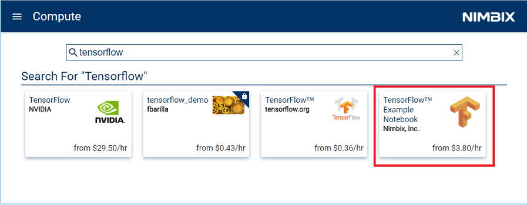
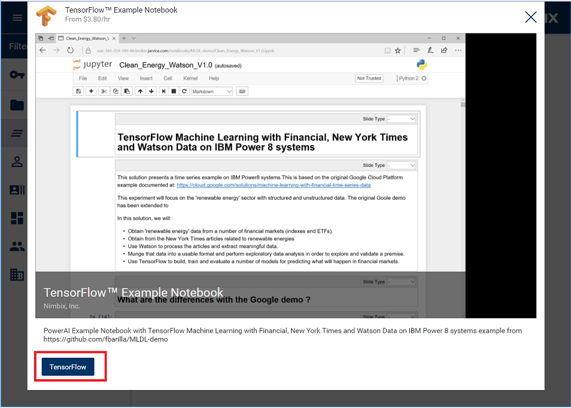
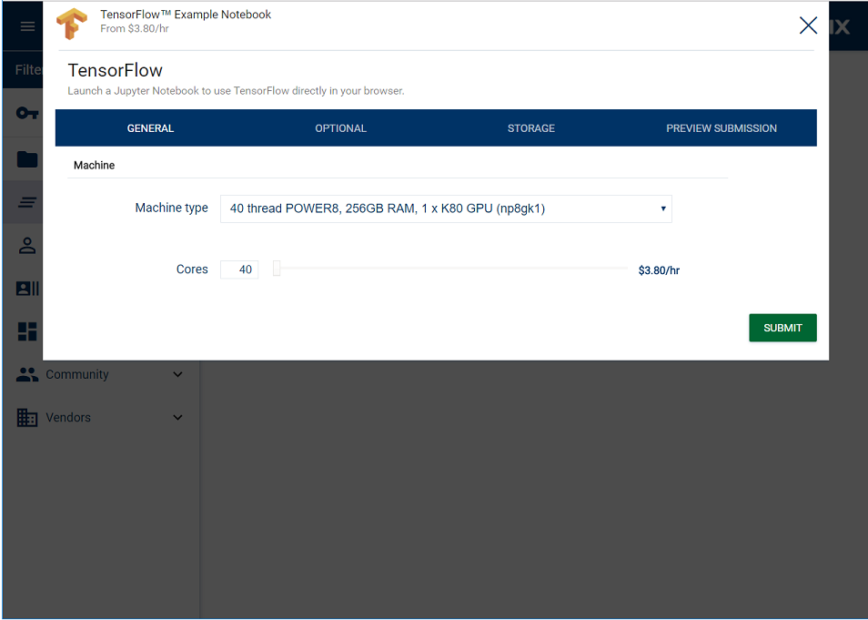
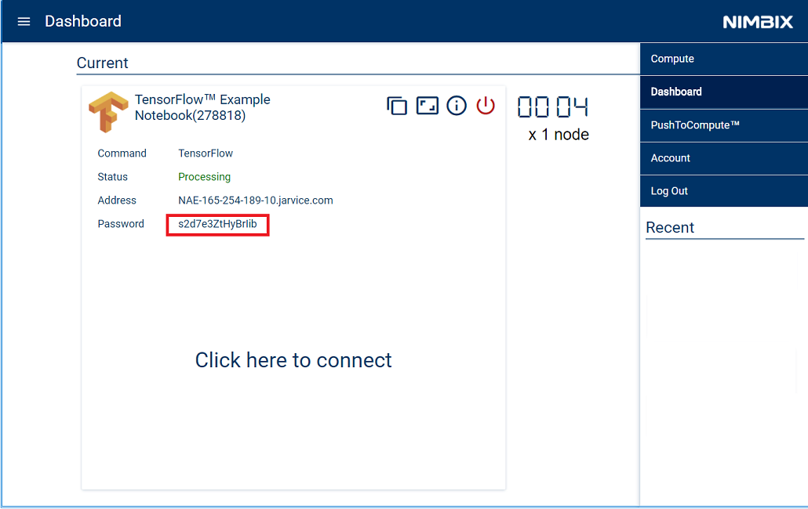
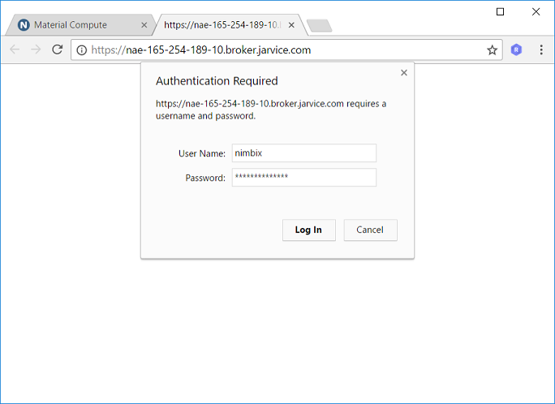
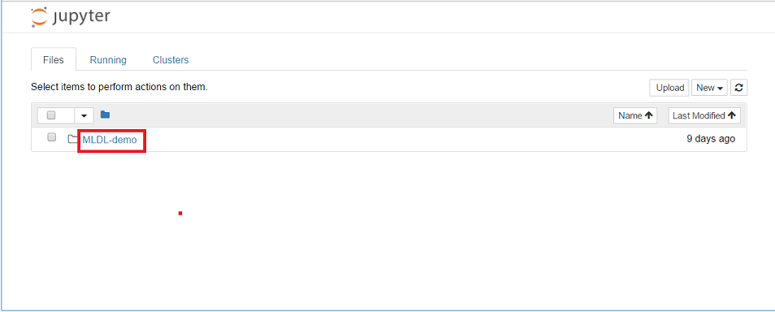
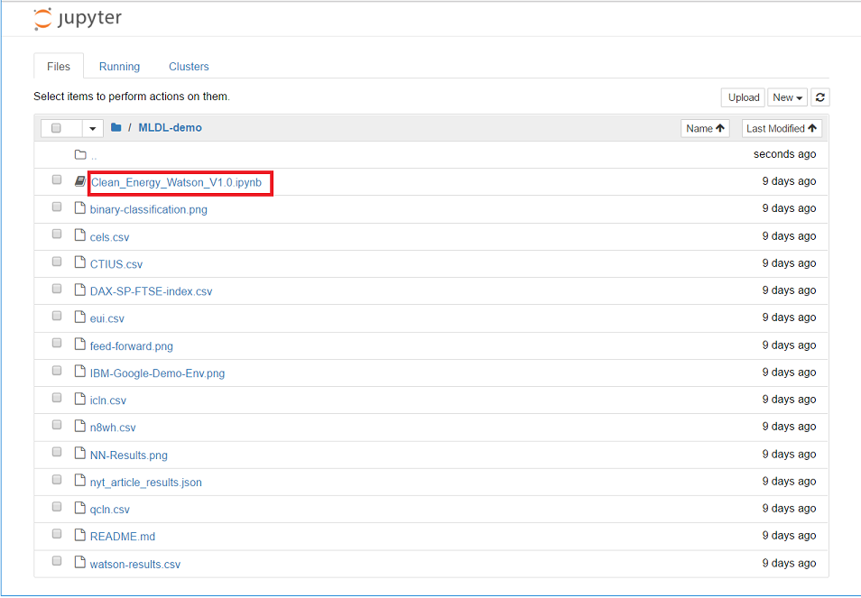

# Avaliando a previsibilidade dos mercados financeiros com sentimentos e dados de mercado do The New York Times.
Nesta jornada do desenvolvedor, utilizaremos um Jupyter Notebook para apresentar um exemplo de aprendizado de máquina com série temporal em sistemas IBM Power8. O notebook vai se dedicar a avaliar a previsibilidade de valores do mercado financeiro futuro no setor de energia renovável ao examinar mercados relacionados e o sentimento detectado em artigos do The New York Times.

Depois de concluir esta jornada, o leitor saberá:
* Extrair e formatar dados estruturados a partir de várias fontes externas.
* Extrair e formatar dados não estruturados e usar serviços cognitivos do IBM Watson para extrair sentimentos de dados.
* Desenvolver e treinar redes neurais.
* Exibir e compartilhar resultados em Jupyter Notebooks.

O público-alvo desta jornada são desenvolvedores de aplicativos que precisam desenvolver aplicativos potentes de aprendizado profundo de forma eficiente, mas que talvez não tenham muito tempo nem experiência em ciência de dados.

## Componentes inclusos
* [IBM Watson Natural Language Understanding](https://www.ibm.com/watson/developercloud/natural-language-understanding.html): Um serviço do Bluemix capaz de analisar textos para extrair metadados de conteúdo, como conceitos, entidades, palavras-chave, sentimento, emoção, relações e funções semânticas, usando compreensão de linguagem natural.
* [IBM Power AI](https://www.ibm.com/ms-en/marketplace/deep-learning-platform): Uma plataforma de software que inclui as estruturas mais populares de aprendizado de máquina com IBM Power Systems.
* [IBM Power Systems](https://www-03.ibm.com/systems/power/): O IBM Power Systems é a linha de servidores com base na Power Architecture da IBM, desenvolvida com tecnologias abertas e criada para aplicativos essenciais.
* [Nimbix Cloud Computing Platform](https://www.nimbix.net/): Uma plataforma HPC &amp; Cloud Supercomputing que permite que engenheiros, cientistas e desenvolvedores desenvolvam, calculem, analisem e ajustem a escala de simulações na cloud

## Tecnologias oferecidas
* [Ciência de Dados](https://medium.com/ibm-data-science-experience): Um aplicativo da web de software livre que permite criar e compartilhar documentos que contêm código, equações, visualizações e texto explicativo em tempo real.
* [Tensorflow](https://www.tensorflow.org/): Uma biblioteca de software livre para computação numérica que usa fluxogramas de dados.

# Assista ao vídeo
 

# Etapas

Siga estas etapas para configurar e executar esta jornada do desenvolvedor.
As etapas são descritas em detalhes abaixo.
1. [Inscrever-se para uma conta para teste da Nimbix Cloud Platform](#1-register-for-a-trial-nimbix-cloud-platform-account)
2. [Navegação na IU do Nimbix](#2-navigating-the-nimbix-ui)
3. [Implementar e executar a demonstração do TensorFlow](#3-deploy-and-run-the-tensorflow-demo)
4. [Acessar e iniciar o Jupyter Notebook](#4-access-and-start-the-jupyter-notebook)
5. [Executar o notebook](#5-run-the-notebook)
6. [Analisar os resultados](#6-analyze-the-results) 7. [Salvar e compartilhar](#7-save-and-share)
8. [Encerrar a demonstração do TensorFlow](#8-shut-down-the-tensorflow-demo)

## 1. Inscrever-se para uma conta para teste da Nimbix Cloud Platform
A IBM associou-se ao Nimbix para oferecer aos desenvolvedores da jornada uma conta para teste que forneça 10 horas de tempo de processamento gratuito na plataforma PowerAI. Este é o processo de registro:
* Acesse a [página de registro para a demonstração da jornada cognitiva da IBM](https://www.nimbix.net/cognitive-journey) e envie o formulário para iniciar o processo de registro. 
* Aguarde um e-mail de confirmação. Como esse processo não é automatizado, a revisão e a aprovação poderão demorar até 24 horas.
* Depois de receber o e-mail, você terá 24 horas para concluir o processo. Basta clicar no link fornecido: 
* O link acima levará você à página em que precisa criar e confirmar a senha da conta:  &gt; *OBSERVAÇÃO:* não é necessário um "Código Promocional".
* Aguarde um e-mail de confirmação que conterá instruções para efetuar login no Nimbix: 
* Clique no [link](https://mc.jarvice.com?page=compute&amp;team) para chegar à página de login do Nimbix: 
## 2. Navegação na IU do Nimbix
A IU do Nimbix tem dois controles principais situados na parte superior do painel.
 
* Clique em ``NIBMIX`` para exibir uma lista suspensa dos modos disponíveis. Clique novamente para ocultar a lista. Na visualização de exemplo acima, selecionamos o modo ``Dashboard``.
* No lado esquerdo, clique no ícone ``collapsible`` para exibir uma lista suspensa de visualizações associadas ao modo selecionado. Clique no ícone novamente para ocultar a lista. No exemplo acima, selecionamos a visualização de painel ``Current Jobs``.

## 3. Implementar e executar a demonstração do TensorFlow
Depois de efetuar login no Nimbix, implemente a demonstração em um servidor IBM Power8.
* Procure e selecione ``TensorFlow Example Notebook`` na lista de aplicativos disponíveis na visualização ``Compute:All Applications``. 
* No painel do aplicativo ``TensorFlow Example Notebook``, clique no botão ``TensorFlow``: 
* No painel de configuração ``TensorFlow``, aceite todos os valores padrão e clique no botão ``Submit``:  &gt; *OBSERVAÇÃO:* ignore a cobrança "$3.80/hr" listada. Com sua conta para teste, você recebe 10 horas de tempo de processamento gratuito.
* Depois de iniciar, o painel ``Dashboard`` a seguir será exibido. Quando o ``Status`` do servidor se torna ``Processing``, o servidor está pronto para ser acessado. Anote o valor de ``Password``.
* Clique em ``Click here to connect`` para ativar o acesso à web do notebook. 
* Efetue login usando o nome do usuário ``nimbix`` e a senha fornecida anteriormente. 
* Na listagem de arquivos do notebook, clique em ``MLDL-demo``. 
## 4. Acessar e iniciar o Jupyter Notebook
Clique no link ``Clean_Energy_Watson_V1.0.ipynb`` para iniciar o Jupyter Notebook.

## 5. Executar o notebook
Quando um notebook é executado, cada célula de código nele é executada, em ordem, de cima para baixo. Cada célula de código é selecionável e é precedida por uma tag na margem esquerda.

O formato da tag é `In [x]:`. Dependendo do estado do notebook, o `x` pode ser:
* Um espaço em branco, o que indica que a célula nunca foi executada.
* Um número, que representa a ordem relativa em que essa etapa do código foi executada. * Um `*`, o que indica que a célula está em execução no momento. Existem várias maneiras de executar as células de código no seu notebook:
* Uma célula de cada vez.
* Selecione a célula e, em seguida, pressione o botão `Play` na barra de ferramentas.
* Modo de lote, em ordem sequencial.
* Na barra de menu `Cell`, há várias opções disponíveis. Por exemplo, é possível executar todas as células (`Run All`) no seu notebook ou executar todas abaixo (`Run All Below`).

Assim, a execução começará na primeira célula abaixo da célula selecionada no momento e continuará em todas as células seguintes. Observações:
- A respeito da célula `[4]`: Para a jornada, importamos dados do mercado de ações já coletados. Isso pode ser feito dentro do notebook, mas exige acesso a websites financeiros particulares (como Bloomberg), que cobram uma taxa de assinatura.
- A respeito da célula `[5]`: Com a intenção de acelerar o tempo de processamento do notebook, os dados do The New York Times já foram coletados e armazenados em um arquivo JSON e são importados pelo notebook.
- A jornada baseia-se no exemplo original da Google Cloud Platform documentado em https://cloud.google.com/solutions/machine-learning-with-financial-time-series-data.

A diferença entre esta "Demonstração IBM" e a "Demonstração Google" original é mostrada na tabela a seguir: 

## 6. Analisar os resultados
O resultado da execução do notebook é um relatório que poderá ser compartilhado com ou sem compartilhar o código. É possível compartilhar o código para um público que deseja ver como você chegou às suas conclusões.

O texto, o código e a saída/tabelas são combinados em uma única página da web. Para um público que não deseja ver o código, é possível compartilhar uma página da web que exibe apenas texto e saída/tabelas.

Os gráficos e as tabelas produzidos nesta jornada tentam provar que o valor de fechamento do Nasdaq Clean Energy Index pode ser previsto por meio do exame de várias origens de entrada, como o The New York Times e outros mercados financeiros, tanto estrangeiros quanto domésticos.

Esses mercados incluem:
- Clean Tech Index (asx_cti) da Austrália
- DAX (dax_eusdn) da Alemanha
- FTSE100 (ftse-eo100) do Reino Unido
- Credit Suisse (n8wh) do Reino Unido
- First Trust Nasdaq Clean Edge ETF (qcln e cels) dos Estados Unidos
- S&amp;P Global Clean Energy Index (icln e sp_gtced) dos Estados Unidos
- Equity Uncertainty Index (dei) dos Estados Unidos
#### Coletar dados
O notebook começa com a coleta e a formatação de dados:
* Colete e combine três anos de dados financeiros do mercado de ações.
* Colete três anos de artigos sobre "energia verde" do The New York Times. Esses dados são inseridos no serviço Watson Natural Language Understanding para reunir uma análise de sentimentos
- especificamente, atribuindo uma pontuação positiva ou negativa relativa a cada artigo.

#### Analisar dados
A seguir, o notebook utiliza métodos de análise exploratória de dados (exploratory data analysis, ou EDA) para encontrar correlações nos dados. Essas descobertas incluem:
* Durante um período de três anos, existe uma correlação entre todos os índices.

* Existe uma correlação entre os valores atuais de um índice e os valores atrasados do mesmo índice.

* Há dois índices dos Estados Unidos (qcln e icln) que se relacionam com os valores de fechamento de outros índices disponíveis no mesmo dia (ou seja, índices de fora dos Estados Unidos).

Esta é a análise final da EDA:
- O fechamento do índice da Austrália no mesmo dia é um forte indicador do fechamento do Nasdaq Energy Index.
- Os índices europeus são um indicador significativo para o fechamento do Nasdaq Energy Index.
- Os índices dos dias anteriores não foram um bom indicador para o Nasdaq Energy Index.

#### Treinar e testar dados
Após determinar essa correlação nos dados, o notebook usa o TensorFlow e a estrutura de aprendizado de máquina do IBM PowerAI para treinar e testar os dados.

Depois de centenas de milhares de iterações com os dados usando vários modelos, o notebook consegue atingir uma taxa de sucesso de 70% para prever se o Nasdaq Energy Index fecharia em alta ou em baixa em um dia específico.

## 7. Salvar e compartilhar

### Como salvar seu trabalho:
Como esse notebook está sendo executado temporariamente em um servidor da Cloud Nimbix, as opções de salvar e compartilhar são limitadas. No menu `File`, há estas opções:
* `Download as...` fará download do notebook no seu sistema local.
* `Print Preview` permitirá imprimir o estado atual do notebook.

## 8. Encerrar a demonstração do TensorFlow
Após concluir a demonstração do TensorFlow, lembre-se de encerrar o servidor para liberar recursos na Nimbix Cloud Platform. Além disso, não se esqueça de que o registro para teste gratuito oferece apenas 10 horas de tempo de computação.
* Na visualização do Nimbix ``Dashboard:Current Jobs``, clique no botão ``Shutdown`` e confirme.

 

<!--
# Sample output

The following is a sample data visualization with code
 
 For a full example without code see [`data/examples/sample_output.pdf`](data/examples/sample_output.pdf).
-->

# Resolução de Problemas

[Consulte DEBUGGING.md.](DEBUGGING.md)

# Licença

[Apache 2.0](LICENÇA)
