# New York Times 뉴스와 마켓 데이터를 사용하여 금융 시장의 예측 가능성 평가하기

*다른 언어로 보기: [English](README.md).*

이 개발자 과정에서는 Jupyter Notebook을 사용하여 IBM Power8 시스템에서 시계열을 활용한 머신러닝 예제를 보여줍니다. 이 노트북은 New York Times의 뉴스기사에 나타난 정서와 관련 마켓 데이터를 조사하여 재생 에너지 분야의 미래 금융 시장 가치에 대한 예측 가능성을 평가하는데 중점을 둘 것입니다.

이 과정을 마치면 다음을 이해할 수 있습니다:

* 다양한 외부 소스에서 구조화 된 데이터(Structured data) 추출 및 형식화
* 구조화되지 않은 데이터(Unstructured data)를 추출 및 형식화하고 IBM Watson Cognitive 서비스를 사용하여 데이터 감정을 분석
* Neutral network를 빌드하고 학습시킴
* Jupyter Notebooks의 결과 표시 및 공유

이 과정은 효과적으로 강력한 딥러닝 애플리케이션을 만들고자 하지만 시간이 부족하거나 데이터 사이언스 경험이 부족한 사람이 활용하기에 적합합니다.


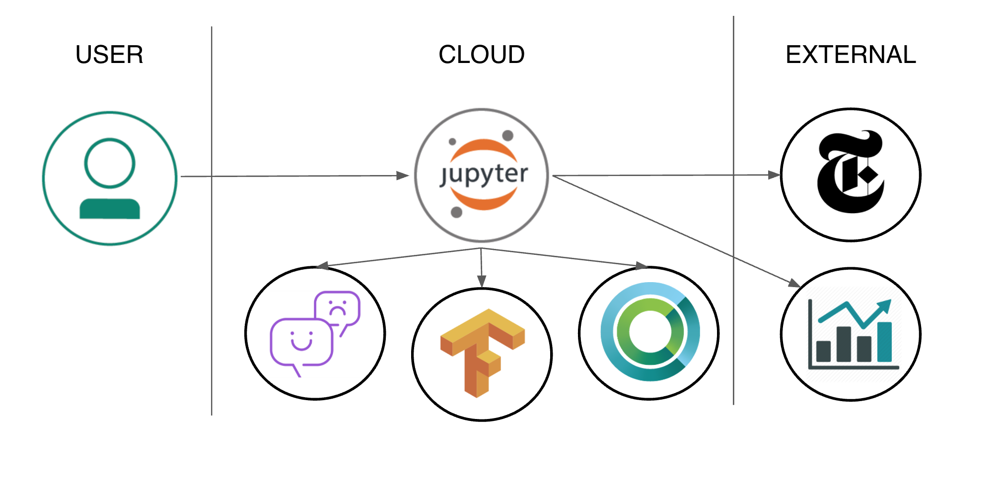

## 사용된 컴포넌트

* [IBM Watson Natural Language Understanding](https://www.ibm.com/watson/developercloud/natural-language-understanding.html): 자연어 이해를 통해 컨텐츠에서 컨셉, 엔티티, 키워드, 카테고리, 정서, 감성, 관계, 의미적 역할과 같은 메타데이터를 추출하기 위한 블루믹스 서비스
* [IBM Power AI](https://www.ibm.com/ms-en/marketplace/deep-learning-platform): IBM Power System과 함께 가장 대중적인 머신 러닝 프레임워크들이 포함된 소프트웨어 플랫폼
* [IBM Power Systems](https://www-03.ibm.com/systems/power/): 오픈 테크놀로지 기술로 구축되고 업무용 응용 프로그램 용으로 설계된 IBM의 Power Architecture 기반 서버 라인
* [Nimbix Cloud Computing Platform](https://www.nimbix.net/): 엔지니어, 과학자 및 개발자가 클라우드에서 시뮬레이션을 작성, 계산, 분석 및 확장 할 수있는 HPC 및 클라우드 슈퍼 컴퓨팅 플랫폼

## 주요 기술

* [Data Science](https://medium.com/ibm-data-science-experience): 실시간 코드, 방정식, 시각화 및 설명 텍스트가 포함 된 문서를 만들고 공유 할 수있는 오픈 소스 웹 응용 프로그램
* [Tensorflow](https://www.tensorflow.org/): 데이터 플로우 그래프를 사용한 수치 계산을 위한 오픈 소스 소프트웨어 라이브러리

# 비디오 보기

[](https://www.youtube.com/watch?v=1nnWj6W7QJI)

# 단계

이 개발자 과정을 설정하고 실행하려면 다음 단계를 따르십시오. 각 단계는 아래에서 자세하게 설명됩니다.

1. [PowerAI 플랫폼에의 24시간 무료 Access받기](#1-powerai-플랫폼에의-24시간-무료-access받기)
1. [Jupyter Notebook 접근 및 시작](#2-jupyter-notebook-접근-및-시작)
1. [Notebook 실행](#3-notebook-실행)
1. [결과 분석](#4-결과-분석)
1. [저장 및 공유](#5-저장-및-공유)
1. [Trial 계정 사용 종료](#6-trial-계정-사용-종료)

## 1. PowerAI 플랫폼에의 24시간 무료 Access받기

IBM과 Nimbux의 파트너쉽으로 PowerAI 플랫폼에서의 24시간 무료 컴퓨팅 시간을 제공하는 평가판 계정이 이 과정을 따라하는 개발자 들에게 제공됩니다.
PowerAI Cognitive 코드 패턴 및 플래폼을 체험하기 위해 Nimbix에 등록하려면 다음 과정을 따르십시오.

* [IBM 마켓플레이스 PowerAI 포탈](https://www.ibm.com/us-en/marketplace/deep-learning-platform)를 방문하여 `Request Trial`을 클릭하십시오.

아래 화면과 같은 IBM PowerAI Trial 페이지에서 IBM Account 생성을 위해 필요한 정보를 입력하고 `Continue`를 클릭하십시오. 이미 IBM ID를 가지고 계시다면 `Already have an account? Log in`을 선택하고 계정 정보를 입력 후 `Continue`를 클릭하십시오.

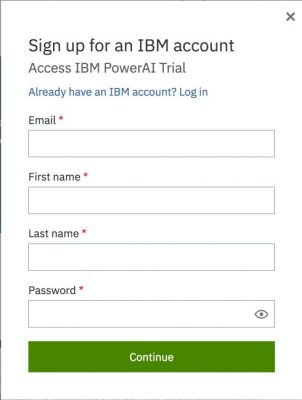

아래 화면과 같은 **Almost there…** 페이지에서 필요한 정보를 입력하고 `Continue`를 클릭하면 등록이 완료됩니다. **IBM Marketplace Products and Services** 페이지를 여십시오.

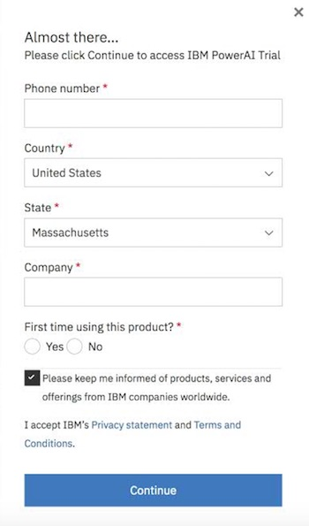

**IBM Marketplace Products and Services** 페이지는 귀하가 사용할 수 있는 모든 Offering을 보여줍니다. PowerAI Trial이 이제 그 중 하나로 생성되어 있을 것입니다. PowerAI Trial 섹션에서 아래에 보이는 대로 `Launch` 를 클릭하면 **IBM PowerAI trial**페이지가 열립니다.

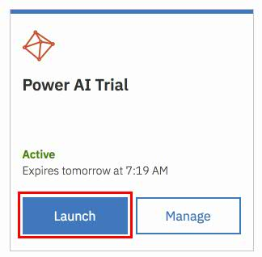

아래 화면처럼 **Welcome to IBM PowerAI Trial** 페이지는 Trial에 접근하기 위한 가이드를 제공합니다. 또는 귀하가 Trial을 시작할 수 있도록 유사한 가이드가 등록을 컨펌하는 이메일로 전달됩니다.

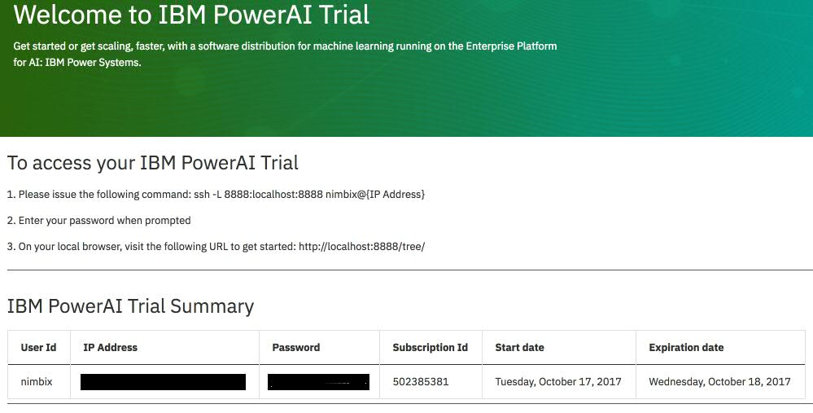

Trial 계정으로 시작하는 과정 요약:

* 사용하고 계신 노트북에서 커맨드창을 열고 다음 명령을 수행하십시오. `{IP Address}`에는 Welcome페이지 또는 등록 컨펌 이메일에 명시된 IP 주소 또는 호스트네임을 입력하십시오.
  ```sh
  ssh -L 8888:localhost:8888 nimbix@{IP Address}
  ```

* 패스워드를 입력하라고 나오면 Welcome페이지 또는 등록 컨펌 이메일에 명시된 패스워드를 입력하십시오.
* 시작하려면 브라우저에서 다음 URL에 접속하십시오: http://localhost:8888/tree/.

## 2. Jupyter Notebook 접근 및 시작

노트북 예제 및 데이터를 한번에 다운로드 하려면 git clone을 사용하십시오.

* ```New```를 클릭하고 ``Terminal``를 선택하여 터미널을 엽니다.

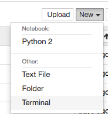

* Git 레파지토리를 Clone하기 위해 다음 명령을 실행하세요.:
```commandline
git clone https://github.com/IBM/powerai-notebook
```

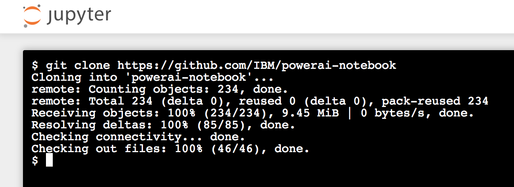

* 이제 터미널을 종료하고 노트북 브라우저로 돌아옵니다. ``Files``탭을 사용하여 ``powerai-notebook``을 클릭하고 ``notebooks``을 선택한 후 ``Clean_Energy_Watson_V1.0.ipynb``를 선택하면 노트북을 오픈할 수 있습니다.

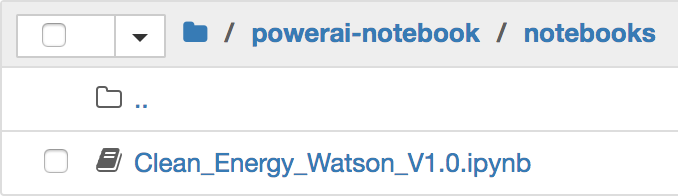

## 3. Notebook 실행

노트북을 실행시키면 노트북의 각 코드 셀이 위에서 아래로 순서대로 실행됩니다.

각 코드 셀은 선택 가능하며 왼쪽 여백에 태그가 붙습니다. 태그 형식은 `In [x]:` 입니다. 노트북의 상태에 따라 `x` 는 다음과 같이 표시됩니다.:

* 공백은 한번도 실행된 적이 없는 셀을 나타냅니다.
* 숫자는 이 코드 단계가 실행된 상대적 순서를 나타냅니다.
* `*` 은 그 셀이 현재 실행중임을 나타냅니다.

노트북에서 코드 셀을 실행시키는 방법은 여러가지가 있습니다.:

* 한번에 하나의 셀을 실행
  * 셀을 선택하고 툴바에 있는 `Play` 버튼을 클릭합니다.
* 순서대로 배치 모드로 실행
  * `Cell` 메뉴바에 몇가지 옵션이 있습니다. 예를들어, `Run All` 옵션으로 노트북에 있는 모든 셀을 실행시킬 수 있습니다. `Run All Below` 옵션으로 현재 선택된 첫번째 셀부터 실행하고 다음 계속되는 모든 셀을 계속 실행할 수 있습니다.

참조:

- 셀 `[4]` 부연 설명: 이 개발자 과정에서는 이미 수집된 주식 시장 데이터를 가져옵니다. 이는 노트북에서 수행할 수 있지만 유료 금융 웹 사이트(예: Bloomberg)의 권한을 필요로 합니다.

- 셀 `[5]` 부연 설명: 노트북 처리 시간을 빠르게 하기 위해, New York Times 데이터는 이미 JSON 파일로 수집되어 저장돼 있는 것을 노트북에서 가져와서 사용합니다.

- 이 개발자 과정은 Google Cloud Platform 예제를 바탕으로 만들어 졌습니다. 구글 예제에 대한 문서는 https://cloud.google.com/solutions/machine-learning-with-financial-time-series-data 에서 확인할 수 있습니다. "IBM 데모"와 기존 "Google 데모"의 차이점은 다음 테이블에서 확인하십시오.:

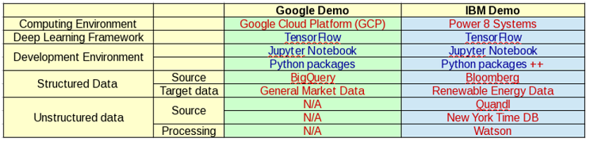

## 4. 결과 분석

노트북을 실행한 결과는 코드와 함께 또는 코드 없이 공유할 수 있는 레포트 입니다. 코드는 어떻게 결론에 이르렀는지를 보고 싶어 하는 사람에게 공유하면 좋습니다. 텍스트, 코드 그리고 결과/차트는 단일 웹 페이지로 결합됩니다. 코드를 보고 싶어하지 않는 사람에게는 텍스트와 결과/차트만 보여주는 웹 페이지로 공유할 수 있습니다.

이 개발자 과정에서 그래프와 차트는 나스닥 청정 에너지 지수의 종가가 New York Times나 국내외의 기타 금융 시장과 같은 다양한 데이터 소스를 조사하여 예측될 수 있다는 것을 증명하려고 시도합니다. 이러한 시장에는 다음을 포함합니다.:

- Australian Clean Tech Index (asx_cti)
- Germany DAX (dax_eusdn)
- UK FTSE100 (ftse-eo100)
- UK Credit Suisse (n8wh)
- US First Trust Nasdaq Clean Edge ETF (qcln and cels)
- US S&P Global Clean Energy Index (icln and sp_gtced)
- US Equity Uncertainty Index (dei)

#### 데이터 수집

이 노트북은 데이터 수집 및 구조화로 시작합니다.:

* 3년간의 시장 재무 데이터를 수집하고 병합합니다.

* New York Times로부터 3년간의 "green energy"에 대한 기사를 수집합니다. 이 데이터를 Watson Natural Language Understanding 서비스로 분석하여 정서 데이터를 수집합니다. - 구체적으로, 상대적으로 긍정적인지 부정적인지에 대한 점수를 각 기사에 매깁니다.

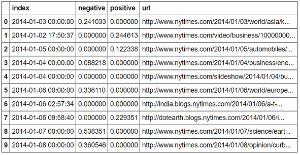

#### 데이터 분석

그런 다음 노트북은 EDA (탐색 데이터 분석, exploratory data analysis) 방법을 활용하여 데이터에서 상관 관계를 찾습니다. 이 결과는 다음과 같습니다:

* 3 년 동안 모든 지수 사이에 상관 관계가 있었습니다.

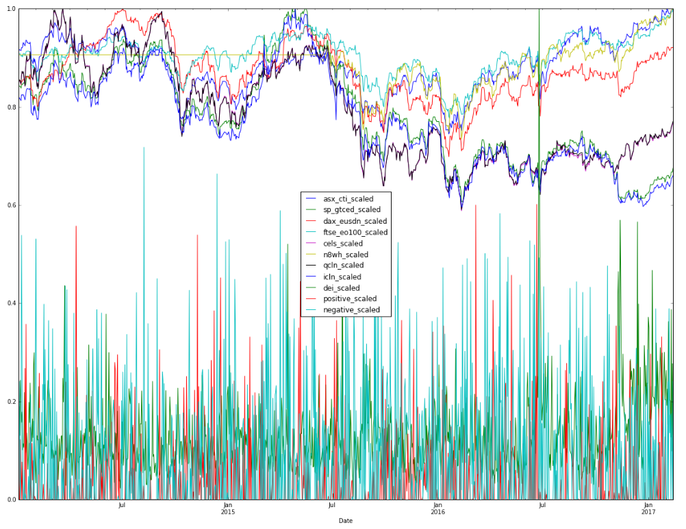

* 어떠한 인덱스의 현재 값과 지연 값 사이에는 상관 관계가 있습니다.

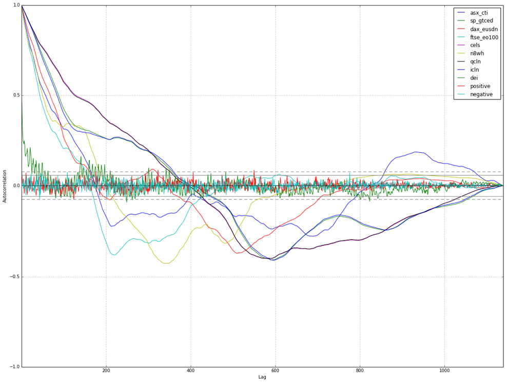

* 같은 날에 사용 가능한 다른 인덱스(즉, 미국 이외의 인덱스)의 종가와 상관 관계가 있는 2개의 미국 인덱스(qcln 과 icln)가 있습니다.

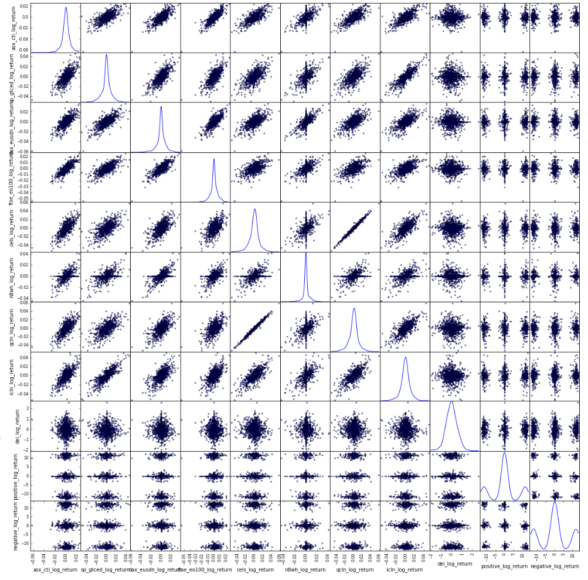

EDA의 최종 분석은 다음과 같습니다.:
- 같은 날 호주 지수의 종가는 나스닥 에너지 지수 종가에 대한 강력한 예측 지표이다.
- 유럽 지수들은 나스닥 에너지 지수 종가의 주요한 예측 지표이다.
- 전날의 지수들은 나스닥 에너지 지수에 대해 좋은 예측 지표가 아니었다.

#### 데이터 학습 및 테스트

데이터에서 이 상관관계를 확인한 후, 이 노트북은 TensorFlow와 IBM PowerAI 머신 러닝 프레임워크를 사용하여 데이터를 학습 및 테스트 합니다.

여러 모델을 사용하여 데이터에 대해 수십만 번의 반복 작업을 수행한 후, 이 노트북은 나스닥 지수가 특정 날짜에 올라가거나 내려가는 것을 예측하는 데에 70%의 성공률을 달성할 수 있습니다.

## 5. 저장 및 공유

### 작업 저장 방법:

이 노트북은 Nimbix Cloud 서버에서 일시적으로 실행되므로 노트북을 저장하고 공유하는 옵션이 제한됩니다.

`File` 메뉴에 다음과 같은 옵션이 있습니다.:

* `Download as...` 로컬 시스템에 노트북을 다운로드합니다.
* `Print Preview` 노트북의 현재 상태를 인쇄합니다.

## 6. Trial 계정 사용 종료

실습을 마친 후에는 ssh session에서 다음 명령을 실행하거나 **My Products and Services**페이지에 있는 `Manage` 링크를 통해 Trial계정을 종료시켜 주십시오.

```sh
sudo poweroff --force
```

# 문제 해결(Troubleshooting)

[DEBUGGING.md를 참조하십시오.](DEBUGGING.md)

# 라이센스(License)

[Apache 2.0](LICENSE)
