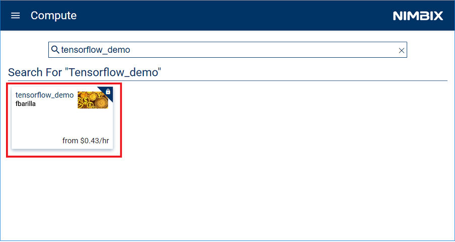
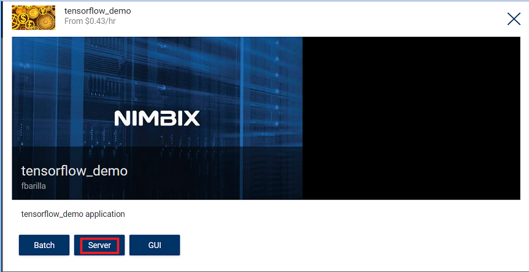
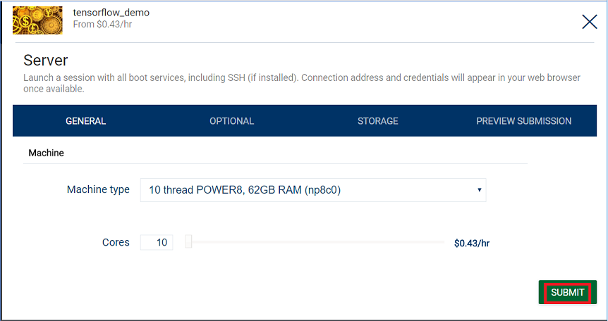
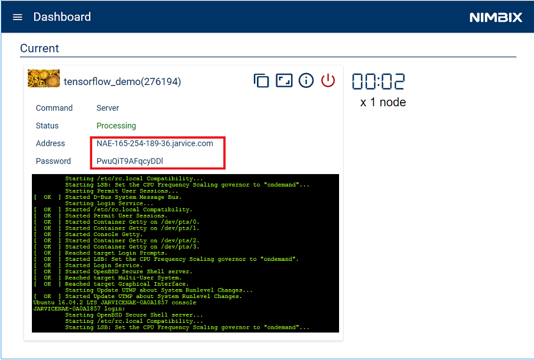
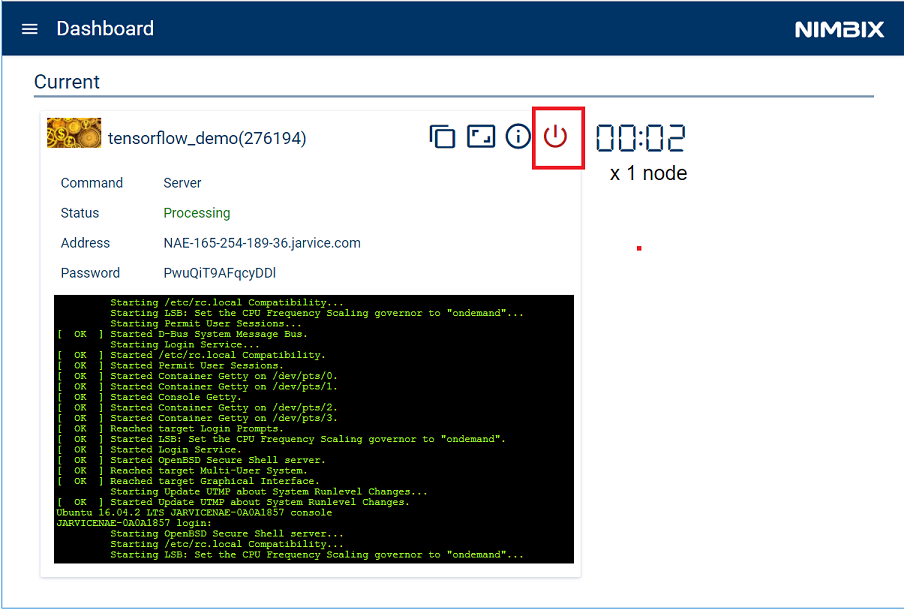

# Evaluating predictability of financial markets using New York Times sentiments and market data.

In this developer journey we will use a Jupyter notebook to showcase an
example of machine learning with time series on IBM Power8 systems. The
notebook will focus on evalulating the predictability of future
financial market values in the "renewable energy" sector by examining
related markets and sentiment detected in New York Times news articles.

When the reader has completed this journey, they will understand how to:

* Extract and format structured data from various external sources.
* Extract and format unstructured data and use IBM Watson cognitive
services to extract data sentiment.
* Build and train Neural Networks.
* Display and share results in Jupyter notebooks.

The intended audience for this journey is application developers who need
to efficiently build powerful deep learning applications, but who may
not have an abundance of time or data science experience.

## Included components

* [IBM Watson Natural Language Understanding](https://www.ibm.com/watson/developercloud/natural-language-understanding.html): A Bluemix service that can analyze text to extract meta-data from content such as concepts, entities, keywords, categories, sentiment, emotion, relations, semantic roles, using natural language understanding.
* [IBM Power AI](https://www.ibm.com/ms-en/marketplace/deep-learning-platform): A software platform that includes the most popular machine learning frameworks with IBM Power Systems.
* [IBM Power Systems](https://www-03.ibm.com/systems/power/): IBM Power Systems is IBM's Power Architecture-based server line, built with open technologies and designed for mission-critical applications.
* [Nimbix Cloud Computing Platform](https://www.nimbix.net/): An HPC & Cloud Supercomputing platform enabling engineers, scientists & developers, to build, compute, analyze, and scale simulations in the cloud

## Featured technologies

* [Data Science](https://medium.com/ibm-data-science-experience): An open-source web application that allows you to create and share documents that contain live code, equations, visualizations and explanatory text.
* [Tensorflow](https://www.tensorflow.org/): An open source software library for numerical computation using data flow graphs.

# Steps

Follow these steps to setup and run this developer journey. The steps are
described in detail below.

1. [Register for a Trial Nimbix Cloud Platform account](#1-register-for-a-trial-nimbix-cloud-platform-account)
2. [Navigating the Nimbix UI](#2-navigating-the-nimbix-ui)
3. [Deploy and run the TensorFlow Demo](#3-deploy-and-run-the-tensorflow-demo)
4. [Access and start the Jupyter notebook](#4-access-and-start-the-jupyter-notebook)
5. [Run the notebook](#5-run-the-notebook)
6. [Analyze the results](#6-analyze-the-results)
7. [Save and share](#7-save-and-share)
8. [Shut down the TensorFlow Demo](#8-shut-down-the-tensorflow-demo)

## 1. Register for a Trial Nimbix Cloud Platform account

IBM has partnered with Nimbix to provide journey developers a trial
account that provides 10 hours of free processing time on the PowerAI
platform.

The registration process is as follows:

* Go to the [IBM Cognitive Journey Demo Registration Page](https://www.nimbix.net/cognitive-journey)
and submit the form to initiate the registration process.

* Wait for a confirmation email. Note that this process is not automated so
it may take up to 24 hours to be reviewed and approved.
* Once you receive the email, you will have 24 hours to complete the process
by clicking on the provided link:

* The above link will take you to this page where you need to create and
confirm your account password:

> *NOTE:* A "Promotional Code" is not required.

* Wait for a confirmation email that will will provide instructions
for logging into Nimbix:

* Click the [link](https://mc.jarvice?page=compute&team) to take you to
the Nimbix login page:

## 2. Navigating the Nimbix UI

The Nimbix UI has two main controls located at the top of the panel.

* Click on ``NIBMIX`` to display a drop-down list of available modes. Click
again to hide the list. In the example view above, we have selected
the ``Dashboard`` mode.

* On the left-side, click on the ``collapsable`` icon to display a
drop-down list of views that are associated with the selected mode.
Click on the icon again to hide the list. In the example above, we have
selected the ``Current Jobs`` dashboard view.

## 3. Deploy and run the TensorFlow demo

Once signed into Nimbix, deploy the demo on an IBM Power8 server.

* Search for and select the ``tensorflow_demo`` in the list of available apps
in the ``Compute:All Applications`` view.

* From the ``tensorflow_demo`` application panel, select the ``Server``
option:

* From the ``Server`` configuration panel, accept all default values and
click on ``Submit``:

> *NOTE:* Ignore the "$0.43/hr" charge listed. With your trial account you receive 10 hours of free processing time.

* Once started, the following ``Dashboard`` panel will be displayed. When
the server ``Status`` turns to ``Processing``, the server is ready to be
accessed.

Take note of the ``Address`` and ``Password`` fields.

Using the information obtained from the previous step, launch the server
session:

* Open a terminal session on the same host that accessed the Nimbix Cloud.

* Enter the following ssh command, substituting the values provided in
the previous step.

    ``ssh -L 8888:localhost:8888 nimbix@<server ip addr>``

* When prompted, enter the supplied password.

From the same terminal window, enter the command ``ipython notebook`` to
launch the Jupyter notebook:

Take note of the URL provided. Use this link to access the notebook.

## 4. Access and start the Jupyter notebook

Proceed to the provided notebook URL and click on the
``Clean_Energy_Watson_V1.0.ipynb`` link to start the Jupyter notebook.

## 5. Run the notebook

When a notebook is executed, what is actually happening is that each code cell in
the notebook is executed, in order, from top to bottom.

Each code cell is selectable and is preceded by a tag in the left margin. The tag
format is `In [x]:`. Depending on the state of the notebook, the `x` can be:

* A blank, this indicates that the cell has never been executed.
* A number, this number represents the relative order this code step was executed.
* A `*`, this indicates that the cell is currently executing.

There are several ways to execute the code cells in your notebook:

* One cell at a time.
  * Select the cell, and then press the `Play` button in the toolbar.
* Batch mode, in sequential order.
  * From the `Cell` menu bar, there are several options available. For example, you
    can `Run All` cells in your notebook, or you can `Run All Below`, that will
    start executing from the first cell under the currently selected cell, and then
    continue executing all cells that follow.

Notes:

- Regading cell `[4]`: For the journey we import already collected
stock market data. This can be done inside the notebook, but requires
access to private financial websites (such as Bloomberg), which requires
a subscription fee.

- Regarding cell `[5]`: In an effort to speed up the
notebook processing time, the New York Times data has already
been collected and stored in a JSON file, and is imported by the notebook.

- The journey is based on the original Google Cloud Platform example
documented at https://cloud.google.com/solutions/machine-learning-with-financial-time-series-data.
The difference between this "IBM Demo" and the original "Google Demo" is noted
in the following table:

## 6. Analyze the results

The result of running the notebook is a report which may be shared with or
without sharing the code. You can share the code for an audience that wants
to see how you came your conclusions. The text, code and output/charts are
combined in a single web page. For an audience that does not want to see
the code, you can share a web page that only shows text and output/charts.

The graphs and charts produced in this journey attempt to prove that the
closing value of the Nasdaq Clean Energy Index can be predicted by
examining various input sources, such as the New York Times and other
financial markets, both foreign and domestic. These markets include:

- Austrailian Clean Tech Index (asx_cti)
- Germany DAX (dax_eusdn)
- UK FTSE100 (ftse-eo100)
- UK Credit Suisse (n8wh)
- US First Trust Nasdaq Clean Edge ETF (qcln and cels)
- US S&P Global Clean Energy Index (icln and sp_gtced)
- US Equity Uncertainty Index (dei)

#### Collect Data

The notebook begins by collecting and formatting data:

* Collect and merge 3 years of stock market financial data.

* Collect 3 years of "green energy" articles from the New York
Times. This data is then feed into the Watson Natural Language Understanding
service to gather sentiment analysis - specifically by assigning a
relative positive or negative score to each article.

#### Analyze Data

The notebook then utilizes EDA (exploratory data analysis) methods to
find correlations in the data. These findings include:

* Over a 3-year period, there is a correlation between all of the indexes.

* There is a correlation between current values of an index and lagged
values of the same index.

* There are 2 US indexes (qcln and icln) that correlate with the closing
values of other indexes available on the same day (i.e. non-US indexes).

The final analysis from the EDA are as follows:
- The Austrailian Index close from the same day is a strong predictor
for the close of the Nasdaq Energy Index.
- European indices are a significant predictor for the close of the
Nasdaq Energy Index.
- Indices from previous days were not a good predictor for the Nasdaq
Energy Index.

#### Train and Test Data

After determining this correlation in the data, the notebook then
uses TensorFlow and the IBM PowerAI machine learning framework to train
and test the data.

After hundreds of thousands of interations over the data using multiple
models, the notebook is able to achieve a 70% success rate for
predicting whether the Nasdaq Energy Index would close up or down on any
given day.

## 7. Save and share

### How to save your work:

Because this notebook is running temporarily on a Nimbix
Cloud server, the options to saving and sharing the notebook are limited.

Under the `File` menu, there are options to:

* `Download as...` will download the notebook to your local system.
* `Print Preview` will allow you to print the current state of the
  notebook.

## 8. Shut down the TensorFlow demo

After completing the TensorFlow demo, please remember to shutdown the server
to free up resourses on the Nimbix Cloud Platform. Also, remember that
the free trial regisration only provides 10 hours of compute time.

* From the Nimbix ``Dashboard:Current Jobs`` view, click on the
``Shutdown`` button and confirm.

<!--
# Sample output

The following is a sample data visualization with code
 
 For a full example without code see [`data/examples/sample_output.pdf`](data/examples/sample_output.pdf).
-->

# Troubleshooting

[See DEBUGGING.md.](DEBUGGING.md)

# License

[Apache 2.0](LICENSE)
