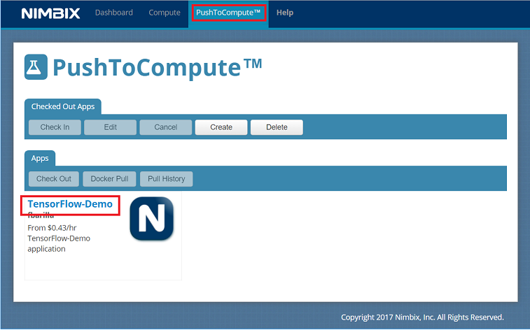
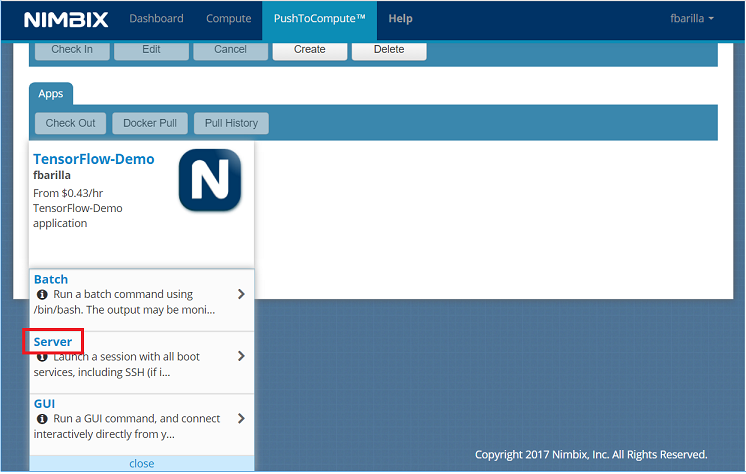
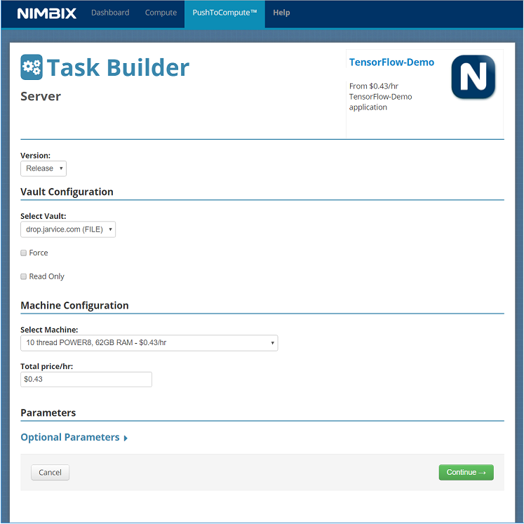
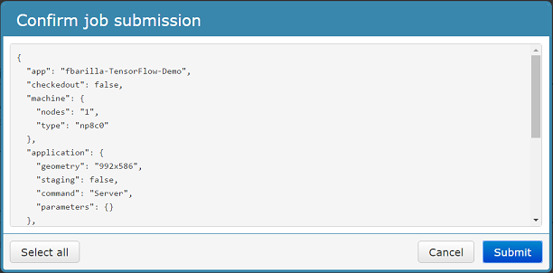
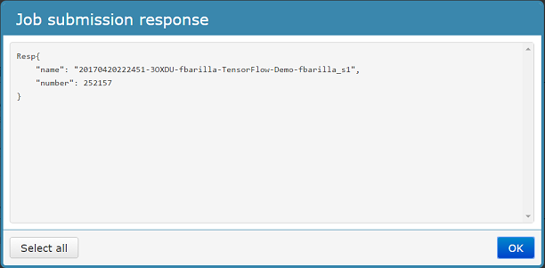
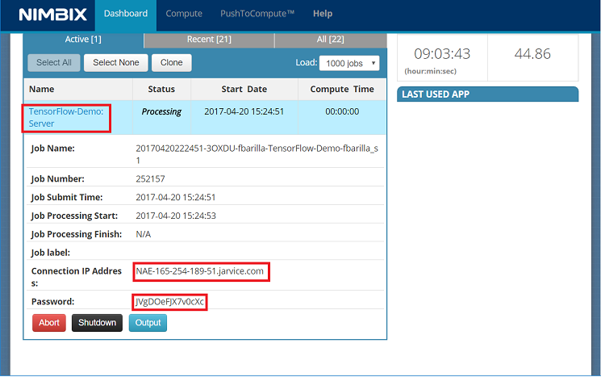
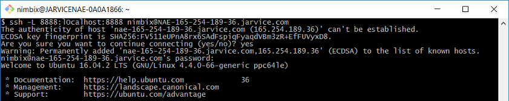
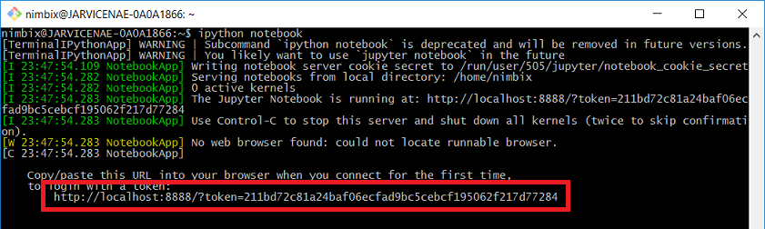
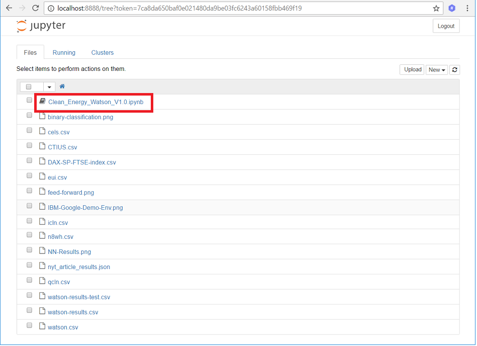
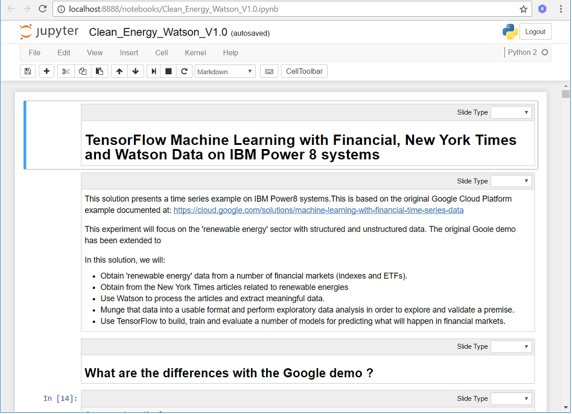

# Evaluating predictability of financial markets using New York Times sentiments and market data.

In this developer journey we will use a Jupyter notebook to showcase an
example of machine learning with time series on IBM Power8 systems. The
notebook will focus on evalulating the predictability of future
financial market values in the "renewable energy" sector by examining
related markets and sentiment detected in New York Times news articles.

When the reader has completed this journey, they will understand how to:

* Extract and format structured data from various external sources.
* Extract and format unstructured data and use IBM Watson cognitive
services to data sentiment.
* Build and train Neural Networks.
* Display and share results in Jupyter notebooks.

The intended audience for this journey is application developers who need
to efficiently build powerful deep learning applications, but who may
not have an abundance of time or data science experience.

## Included components

* [IBM Watson Tone Analyzer](https://www.ibm.com/watson/developercloud/tone-analyzer.html): A Bluemix service that uses linguistic analysis to detect communication tones in written text.

* [IBM Power AI](https://www.ibm.com/ms-en/marketplace/deep-learning-platform): A software platform that includes the most popular machine learning frameworks with IBM Power Systems.

* [Nimbix Cloud Computing Platform](https://www.nimbix.net/): An HPC & Cloud Supercomputing platform enabling engineers, scientists & developers, to build, compute, analyze, and scale simulations in the cloud

## Featured technologies

* [Data Science](https://medium.com/ibm-data-science-experience): An open-source web application that allows you to create and share documents that contain live code, equations, visualizations and explanatory text.

* [Tensorflow](https://www.tensorflow.org/): An open source software library for numerical computation using data flow graphs.

# Steps

Follow these steps to setup and run this developer journey. The steps are
described in detail below.

1. [Register for a Nimbix Cloud Platform account](#1-register-for-nimbix-cloud-platform-account)
2. [Deploy and run the TensorFlow Demo](#2-deploy-and-run-tensorflow-demo)
3. [Access and start the Jupyter notebook](#3-access-and-start-the-jupyter-notebook)
4. [Analyze the results](#4-analyze-the-results)
5. [Save and share](#5-save-and-share)

## 1. Register for a Nimbix Cloud Platform account

Register for Power AI on the [Nimbix Cloud](https://platform.jarvice.com/login-page).

## 2. Deploy and run TensorFlow demo

Once signed into Nimbix, deploy the demo on an IBM Power8 server.

* From the Nimbix dashboard, switch to the ``PushToCompute`` panel and
click on the ``TensorFlow-Demo`` application:

* From the ``TensorFlow-Demo`` drop-down menu, select option to launch
server:

* Confirm all default configuration options and launch the server:

* From the ``Dashboard`` panel, select the ``TensorFlow-Demo: Server``
to view the server job information. Take note of the server IP address
and password:

Using the information obtained from the previous step, launch the server
session:

* Open a terminal session on the same host that accessed the Nimbix Cloud.

* Enter the following ssh command, substituting the values provided in
the previous step.

    ``ssh -L 8888:localhost:8888 nimbix@<server ip addr>``

* When prompted, enter the supplied password.

From the same terminal window, enter the command ``ipython notebook`` to
launch the Jupyter notebook:

Take note of the URL provided. Use this link to access the notebook.

## 3. Access and start the Jupyter notebook

Proceed to the provided notebook URL and click on the
``Clean_Energy_Watson_V1.0.ipynb`` link to start the Jupyter notebook.

## 4. Analyze the results

**Coming Soon!**

## 5. Save and share

### How to save your work:

Under the `File` menu, there are several ways to save your notebook:

* `Save` will simply save the current state of your notebook, without any version
  information.
* `Save Version` will save your current state of your notebook with a version tag
  that contains a date and time stamp. Up to 10 versions of your notebook can be
  saved, each one retrievable by selecting the `Revert To Version` menu item.

### How to share your work:

You can share your notebook by selecting the “Share” button located in the top
right section of your notebook panel. The end result of this action will be a URL
link that will display a “read-only” version of your notebook. You have several
options to specify exactly what you want shared from your notebook:

* `Only text and output`: will remove all code cells from the notebook view.
* `All content excluding sensitive code cells`:  will remove any code cells
  that contain a *sensitive* tag. For example, `# @hidden_cell` is used to protect
  your dashDB credentials from being shared.
* `All content, including code`: displays the notebook as is.
* A variety of `download as` options are also available in the menu.

# Sample output

<!--
The following is a sample data visualization with code
 
 For a full example without code see [`data/examples/sample_output.pdf`](data/examples/sample_output.pdf).
-->

# Troubleshooting

[See DEBUGGING.md.](DEBUGGING.md)

# License

[Apache 2.0](LICENSE)
